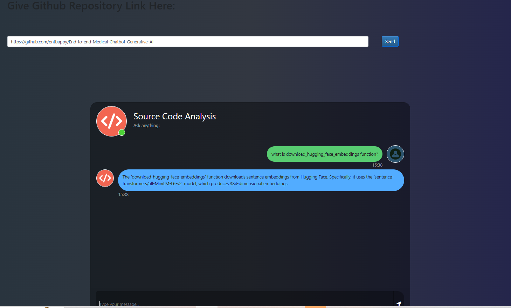

# 😎 Github_Explainer

A chat bot that will explain all the function which is used in that repo file given ,powered by **LangChain, Hugging Face embeddings, and Google Gemini LLM**.  
The chatbot can analyze source code, process queries, and provide contextual answers using **Generative AI**.

---

## 🚀 Features
- 💬 Interactive chatbot interface (Streamlit frontend).  
- 🔎 Source code analysis: Upload GitHub repo link and ask questions about the codebase.  
- 🧠 Embeddings: Uses **Hugging Face Sentence Transformers (all-MiniLM-L6-v2)** for vector embeddings.  
- 🤖 LLM Integration: Powered by **Google Gemini API** via LangChain.  
- 📚 RAG (Retrieval-Augmented Generation) pipeline for contextual answers.  
- ⚡ Runs locally with simple setup.

---

## 🛠️ Tech Stack
- **Frontend:** Streamlit  
- **Backend:** Python, LangChain  
- **Embeddings:** Hugging Face (sentence-transformers/all-MiniLM-L6-v2)  
- **LLM:** Google Gemini API  
- **Vector DB:** FAISS  

---
## ⚙️ Installation & Setup

### 1️⃣ Clone the Repository
```bash
git clone https://github.com/entbappy/End-to-end-Medical-Chatbot-Generative-AI.git
cd End-to-end-Medical-Chatbot-Generative-AI
```

### 2️⃣ Create Conda Environment
```bash
conda create -n llmapp python=3.10 -y
conda activate llmapp
```

### 3️⃣ Install Dependencies
```bash
pip install -r requirements.txt
```

### 4️⃣ Set Up Environment Variables  
Create a `.env` file in the root directory:
```
GOOGLE_API_KEY=your_gemini_api_key
```

### 5️⃣ Run the App
```bash
streamlit run app.py
```

---

## 🧑‍💻 Usage
1. Enter the **GitHub repository link** in the input box.  
2. The app will clone the repo, parse the source code, and generate embeddings.  
3. Ask natural language questions about the codebase (e.g.,  
   *"What does the `download_hugging_face_embeddings` function do?"*).  
4. Get detailed AI-powered responses in real-time.

---

## 📸 Demo
Here’s a screenshot of the chatbot in action:  



---

